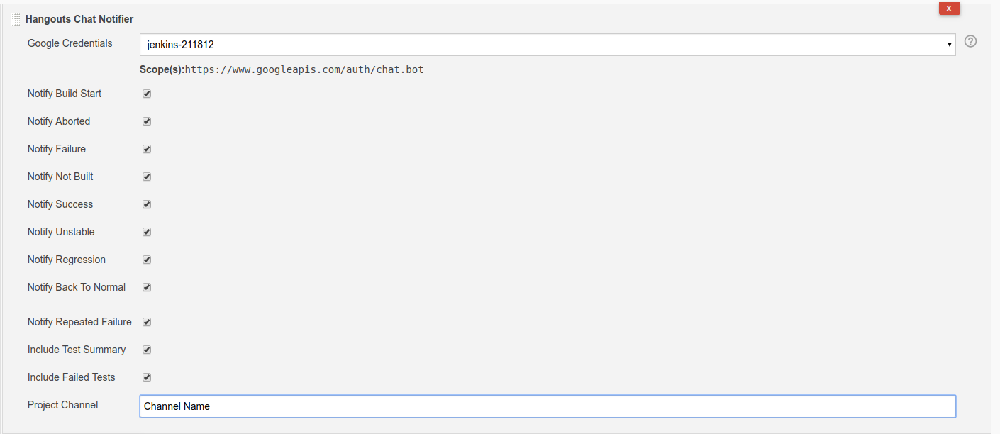

Hangouts Chat plugin for Jenkins

Provides Jenkins notification integration with Google's Hangouts Chat

# Install

Create an HPI file to install in Jenkins (HPI file will be in
`target/jenkins-chat.hpi`).

    mvn clean package

# ScreenShot

# Thanks

[Tiny Speck](https://github.com/tinyspeck) for creating [Slack Plugin](https://github.com/tinyspeck/jenkins-slack-plugin). This helps us a lot to create this plugin.